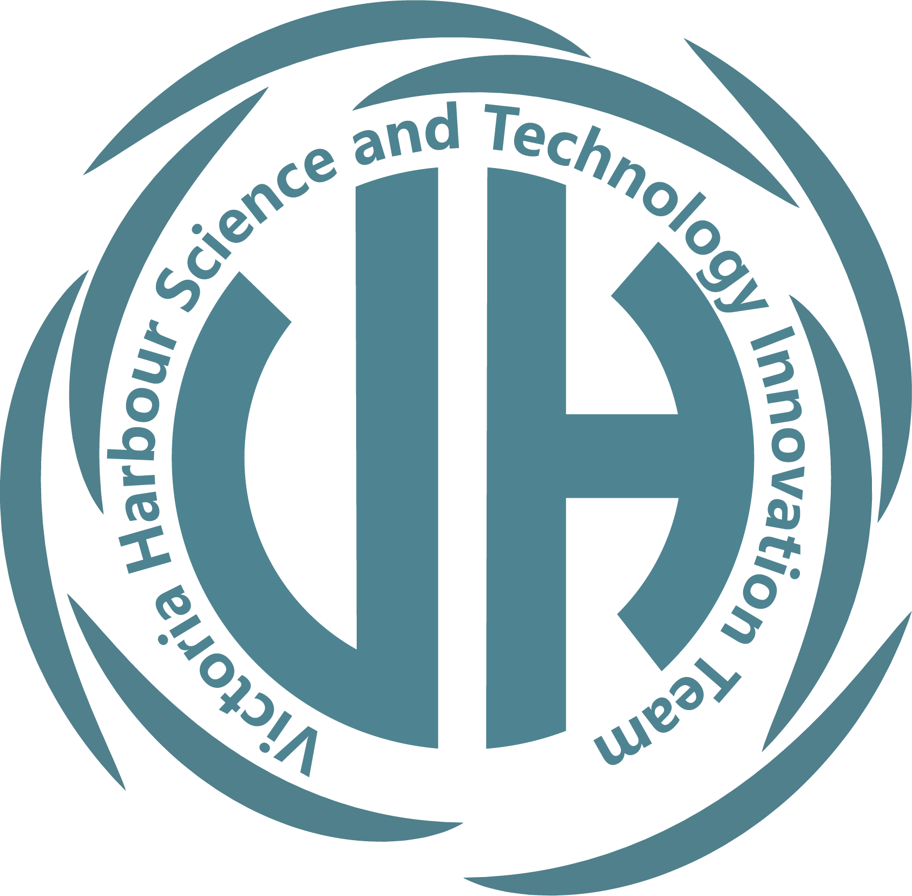

---
hide:
  - navigation
  - toc
---
# VHSTIT Home

!!! info inline end ""

    { loading=lazy }

Welcome to the official homepage of the Victoria Harbour Science and Technology Innovation Team (VHSTIT). We are a technology innovation team directly affiliated with the Affiliated School of JNU for Hong Kong and Macao's Students (ASJ) at the school level, dedicated to advancing technology and research through interdisciplinary collaboration and cutting-edge projects.

## Core Mission and Vision

VHSTIT adheres to the philosophy of "technology-driven innovation, practice achieves the future," focusing on solving practical engineering problems while cultivating members' innovative thinking and engineering practice capabilities. We are committed to building an open, collaborative technology innovation platform that contributes to the technological innovation culture on campus.

## Current Key Projects

Currently, we are actively advancing three core projects:

1. [**Rocket Launch Project**](projects/rocket/index.md): A pioneering aerospace engineering project aimed at developing sustainable and efficient propulsion systems for small-scale aerospace applications, achieving precise altitude control flight and panoramic imaging.
2. [**Smart Campus System**](projects/smart-school/index.md): An integrated platform based on IoT and AI technologies designed to optimize campus operational efficiency and enhance intelligent campus management.
3. [**Fiber-Optic Computer**](projects/computer/index.md): A breakthrough computing technology research focused on leveraging optical computing principles to achieve unprecedented data processing speeds and energy efficiency.

## Team Composition

Our team consists of five passionate members with professional backgrounds, each possessing unique expertise in their respective fields, collectively forming an interdisciplinary technology innovation team. Team members have clear divisions of labor and efficient collaboration to ensure smooth project advancement.

## Site Navigation

-   :material-clock-fast:{ .lg .middle } __Project Logs__

    ---

    Detailed records of key milestones, technical breakthroughs, and phased achievements during project advancement, ensuring traceable processes and transferable experience.

    [:octicons-arrow-right-24: View Logs](log/index.md)

-   :material-account-group:{ .lg .middle } __Team Introduction__

    ---

    Learn about team members' professional backgrounds, role assignments, and project contributions, and get to know this dynamic technology innovation team.

    [:octicons-arrow-right-24: Meet the Team](team/index.md)

-   :fontawesome-solid-diagram-project:{ .lg .middle } __Project Details__

    ---

    Deep dive into technical solutions, implementation progress, and expected outcomes of various projects, exploring our technological innovation pathways.

    [:octicons-arrow-right-24: Explore Projects](projects/index.md)

Latest compile time {{get_time()}}