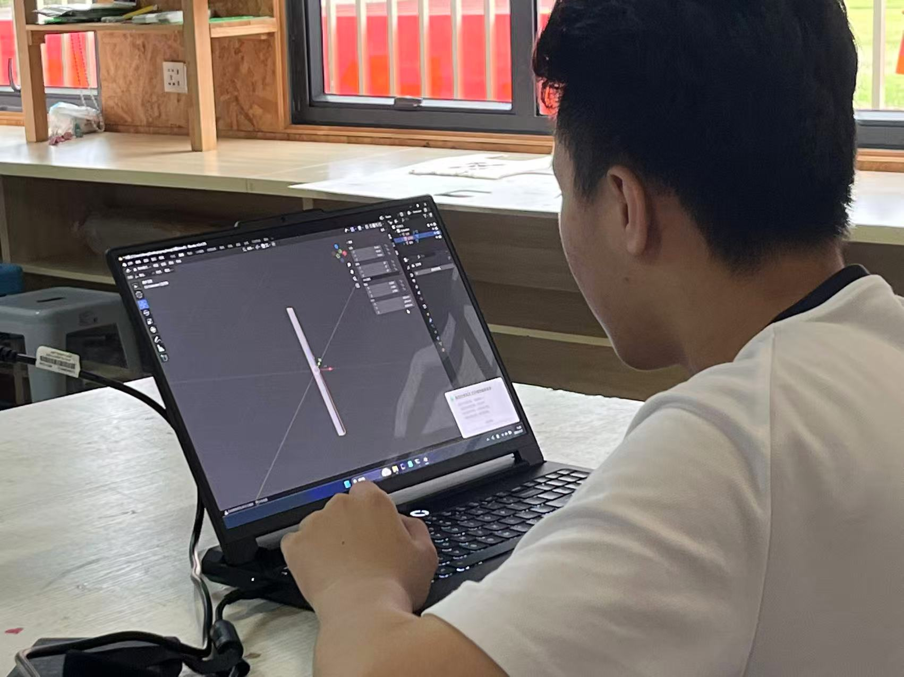
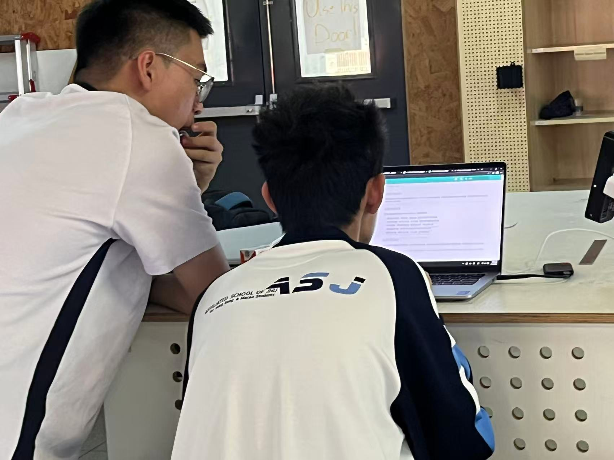

# 项目第一周进展报告

## 概述
本周期内，小组围绕[火箭研发项目](../../projects/rocket/index.md)启动初期核心任务有序推进，完成了从概念认知到初步实践的关键铺垫。

## 相册

<figure markdown="span">
  { loading=lazy }
  <figcaption>进行外形设计</figcaption>
</figure>

<figure markdown="span">
  { loading=lazy }
  <figcaption>处理前端文件</figcaption>
</figure>

## 详细进展

### 1. 核心技术探索与构造设计
- **系统性认知构建**：以“火箭整体研发逻辑”为切入点，通过研读专业文献、拆解经典型号、梳理前沿案例，系统构建了对火箭飞行原理、核心模块及设计规范的基础认知框架。
- **初步方案形成**：团队成员分工协作，从气动布局、结构强度、功能舱段适配性等关键维度进行头脑风暴与草图绘制，形成了构造方案雏形。

### 2. 燃料选型可行性论证
- **专项研讨会**：邀请化学领域成员[徐子豪](../../team/participants/xuzihao.md)参与，针对动力需求、能量密度、安全性等关键指标，深入探讨了液体/固体/混合燃料的技术特性与应用场景。
- **明确技术路径**：厘清了核心约束条件，确定了“**先验证基础燃料可行性，再探索新型燃料优化**”的分步推进策略，为后续攻关指明方向。

### 3. 项目宣传与成果沉淀
- **专属网页搭建**：完成以“进展同步、成果展示、团队风采”为核心的页面架构设计、栏目划分及基础内容填充。
- **初步上线**：核心页面已部署[^1]，为项目对外沟通与成果展示搭建了重要平台。

## 总结
首周工作通过认知积累、跨界沟通与实践探索，明确了发展路径，为后续构造优化、燃料研发及项目推进奠定了坚实基础。

[^1]: 指本站页面