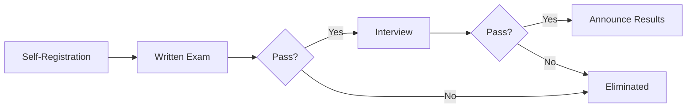
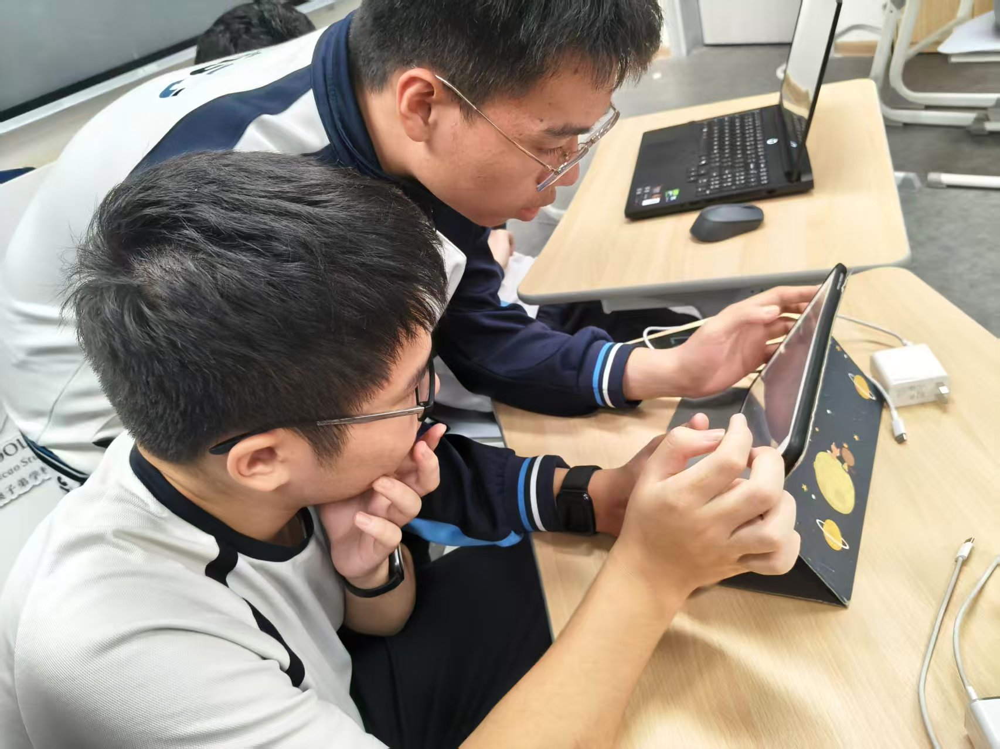

# New Member Assessment - First Round



## Written Screening (2026.01.14)

## Interview Screening (2026.01.15)

## Follow-up Arrangements
- New Member Training Program: 2026.01.18-01.22
- Department Assignment Confirmation: 2026.01.23

## Details
### Images

<figure markdown="span" style="max-width: 600px;">
{ loading=lazy }
<figcaption>Overall Assessment</figcaption>
</figure>

### Assessment Documents
#### New Member Entry Assessment Paper

##### Subjective Questions

**Question 1**  
What is your understanding of the Science and Technology Innovation Team, and why do you want to join?

**Question 2**  
What special skills and achievements do you have in technology? (You may write about subjects or skills you excel in, and if applicable, list relevant technology competitions you've participated in and honors received.)

**Question 3**  
How can your abilities contribute to the team?

##### Ability Questions

**Question 1**  
Which technology is primarily used for real-time, low-latency data transmission between IoT (Internet of Things) devices? ( )  
A. Fifth Generation Mobile Communication Technology (5G)  
B. Sixth Generation Wireless Network Technology (Wi-Fi 6)  
C. Bluetooth 5.0 Technology  
D. All of the above

**Question 2**  
Compared to traditional computers, what is the main advantage of our team's project, the optical-electromagnetic (fiber-optic) computer? ( )  
A. Lower power consumption  
B. Faster processing speed for certain complex problems  
C. Smaller physical size  
D. Easier to manufacture

**Question 3**  
The core activity range of the low-altitude economy is mainly concentrated in ( ), and its industrial system covers multiple fields including aircraft R&D and manufacturing, low-altitude flight operations, and comprehensive support services.  
A. Low-altitude airspace 0-1000 meters from the ground  
B. Low-altitude airspace 0-3000 meters from the ground  
C. Low-altitude airspace 0-5000 meters from the ground  
D. Low-altitude airspace 0-10000 meters from the ground

**Question 4**  
When assembling a 1:100 scale launch vehicle model, which of the following statements about component installation order is correct? ( )  
A. First install the fins, then secure the body支架, and finally connect the body sections  
B. First secure the body支架, then connect the body sections, and finally install the fins  
C. First connect the body sections, then install the fins, and finally secure the body支架  
D. The installation order of the three components can be adjusted arbitrarily and does not affect model stability

**Question 5**  
Which of the following statements about basic physics and chemistry theories is correct? ( )  
A. The rate of chemical reaction is unrelated to the strength of reactant chemical bonds and depends only on reaction temperature and catalysts  
B. When a galvanic cell operates, reduction reactions occur at the negative electrode and oxidation reactions occur at the positive electrode, with electrons flowing from the positive electrode through the external circuit to the negative electrode  
C. For a certain mass of ideal gas, during isochoric change, the gas pressure is directly proportional to thermodynamic temperature  
D. A saturated solution of a substance must be a concentrated solution, and an unsaturated solution must be a dilute solution; the distinction between concentrated and dilute solutions is the same as that between saturated and unsaturated solutions

**Question 6**  
The Tyndall effect can be used to distinguish ______ and ______. The fundamental reason for this effect is that the diameter of dispersed particles is between ______ and ______, which is similar to the wavelength of ______.

**Question 7**  
There are three bottles of unlabeled liquids in the laboratory, known to be NaCl solution, Fe(OH)₃ colloid, and starch colloid. Please design a simple physical method to distinguish them, and write the steps and expected phenomena.

**Question 8**  
Write a Python function decorator that makes the decorated function output "before" before execution and "after" after execution. (Function name is arbitrary)


**Note**: Please try your best to answer these questions. We will assign departments (General and Organization, Theory and Exploration, Electronics and Information, Chemistry and Materials, Engineering and Assembly) based on your responses. Good luck to everyone!

---

#### VHSTIT Team Answers

1. D  
2. B  
3. B  
4. C  
5. C  
6. Colloid; Solution; 1-100nm; Visible Light

7. Use a laser pointer to shine from the side into three test tubes each containing a small amount of liquid. No obvious light path is observed in the NaCl solution; a bright light path is observed in both Fe(OH)₃ colloid and starch colloid. Perform electrophoresis experiment on the two colloids; the one that can move directionally is Fe(OH)₃ colloid (charged), while starch colloid shows no obvious movement.

8. 
```python
def deco(func):
    def wrapper(*args, **kwargs):
        print("before")
        func(*args, **kwargs)
        print("after")
    return wrapper
```
