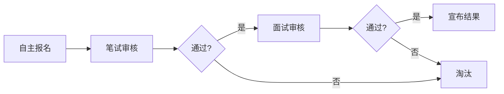

# 新成员考核第一次



## 笔试筛选 (2026.01.14)

## 面试筛选 (2026.01.15)

## 后续安排
- 新人培训计划：2026.01.18-01.22
- 部门分配确认：2026.01.23

## 细节
### 图片

<figure markdown="span" style="max-width: 600px;">
{ loading=lazy }
<figcaption>总测评</figcaption>
</figure>

### 考核文档
#### 新成员入组考核试卷

##### 主观部分

**第一题**  
你对科技创新小组的理解以及你为什么想加入科技创新小组？

**第二题**  
你对科技方面有什么特长和造诣（可以写自己擅长的学科或技能，如果有请写上参加过的相关科技竞赛和获得荣誉）？

**第三题**  
你认为你的能力能给小组带来什么？

##### 能力部分

**第一题**  
以下哪项技术主要用于物联网(IoT)设备之间的实时、低延迟数据传输？（ ）  
A. 第五代移动通信技术(5G)  
B. 第六代无线网络技术(Wi-Fi 6)  
C. 蓝牙5.0技术  
D. 以上皆是

**第二题**  
与传统计算机相比，我们小组的项目之一光电磁（光纤）计算机的主要优势是什么？（ ）  
A. 功耗更低  
B. 对特定复杂问题的处理速度更快  
C. 物理体积更小  
D. 更易于制造

**第三题**  
低空经济的核心活动范围主要集中在（ ），其产业体系涵盖航空器研发制造、低空飞行运营、综合保障服务等多个领域。  
A. 距地面0-1000米的低空空域  
B. 距地面0-3000米的低空空域  
C. 距地面0-5000米的低空空域  
D. 距地面0-10000米的低空空域

**第四题**  
组装1:100比例的运载火箭模型时，下列关于部件安装顺序的说法正确的是（ ）  
A. 先安装尾翼，再固定箭体支架，最后拼接箭体分段  
B. 先固定箭体支架，再拼接箭体分段，最后安装尾翼  
C. 先拼接箭体分段，再安装尾翼，最后固定箭体支架  
D. 三个部件的安装顺序可以随意调整，不影响模型稳定性

**第五题**  
下列关于物理和化学基本理论的说法中，正确的是（ ）  
A. 化学反应速率的大小与反应物的化学键强弱无关，只取决于反应温度和催化剂  
B. 原电池工作时，负极发生还原反应，正极发生氧化反应，电子从正极经外电路流向负极  
C. 一定质量的理想气体，在等容变化过程中，气体的压强与热力学温度成正比  
D. 某物质的饱和溶液一定是浓溶液，不饱和溶液一定是稀溶液，浓稀溶液与饱和不饱和溶液

**第六题**  
利用丁达尔效应可以区分______和______，产生该效应的根本原因是分散质粒子的直径大小在______之间，与______的波长相近。

**第七题**  
实验室中有三瓶失去标签的液体，已知它们分别是NaCl溶液、Fe(OH)₃胶体和淀粉胶体。请设计一个最简单的物理方法将它们鉴别开来，写出步骤和预期现象。

**第八题**  
写一个Python函数装饰器，使被装饰过的函数能在执行前输出和执行后分别输出一个"before"和一个"after"。（函数名随意）


**注**：这些题尽量写便可以，我们会根据你们的回答情况分部（综合与组织部、理论与探索部、电子与信息部、化合与材料部、工程与组装部），祝各位取得好成绩！

---

#### 维港科技小组答案

1. D  
2. B  
3. B  
4. C  
5. C  
6. 胶体；溶液；1-100nm；可见光

7. 用激光笔从侧面照射三支分别盛有少量液体的试管。无明显光路的是NaCl溶液；有明亮光路的是Fe(OH)₃胶体和淀粉胶体。对两胶体进行电泳实验，能定向移动的是Fe(OH)₃胶体（带电），无明显移动的是淀粉胶体。

8. 
```python
def deco(func):
    def wrapper(*args, **kwargs):
        print("before")
        func(*args, **kwargs)
        print("after")
    return wrapper
```