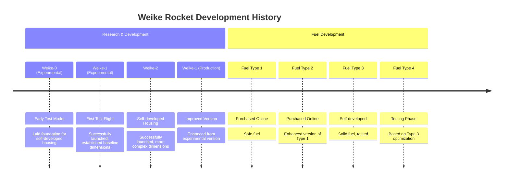
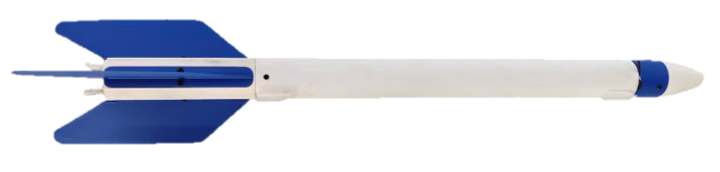

# Rocket Project Related Supplementary Information
> This entry is pending supplementation

## Rocket Development Timeline

## Rocket Model Specifications

| Model | Key Dimensions (cm) | Status | Notes |
| :--- | :--- | :--- | :--- |
| **Weike-0 (Experimental)** | Body length: 53.9 Other characteristic dimensions: 11, 52 | No test flights conducted | Marked as "Test" in notes. This data may correspond to early test models used for design verification. |
| **Weike-1 (Experimental)** | Tail fins/tail section length: 10.8 Body length: 52 Height from launch pad to nose cone: 48 | First test flight, successfully launched | Marked as "No. 1" in notes. These are basic dimensions of first successfully test-flown rocket. |
| **Weike-2** | Tail fins/tail section dimensions: 10.8, 61.4, 60.3 | Self-developed housing, successfully launched | Marked as "No. 2" in notes. Features self-developed housing with more complex dimensional data, possibly involving wingspan or different section lengths. |
| **Weike-1 (Production)** | Tail fins/tail section length: 10.8 Body length: 52 Height from launch pad to nose cone: 48 | Improved from experimental version, successfully launched | Improved from experimental version, specific dimensions may be optimized from the base design. |

### Weike-0 (Experimental Type)
No test flights conducted, laid the foundation for subsequent self-developed housings

<figure markdown="span" style="max-width: 600px;">
  { loading=lazy }
  <figcaption>Weike-0</figcaption>
</figure>

### Weike-1 (Experimental Type)
The first rocket to conduct a test flight, successfully launched

<figure markdown="span" style="max-width: 600px;">
  { loading=lazy }
  <figcaption>Weike-1</figcaption>
</figure>

### Weike-2
Rocket with self-developed housing, successfully launched

<figure markdown="span" style="max-width: 600px;">
  { loading=lazy }
  <figcaption>Weike-2</figcaption>
</figure>

## Fuel Type Specifications

| Fuel Type | Source | Features | Status |
| :--- | :--- | :--- | :--- |
| **Fuel Type 1** | Purchased from online | Safe fuel | In use |
| **Fuel Type 2** | Purchased from online | Safe fuel, enhanced version of Type 1 | In use |
| **Fuel Type 3** | Self-developed | Self-developed solid fuel, tested | Tested |
| **Fuel Type 4** | Based on Fuel Type 3 | Optimized version | Currently under testing |

[Fuel Documentation](src.md)