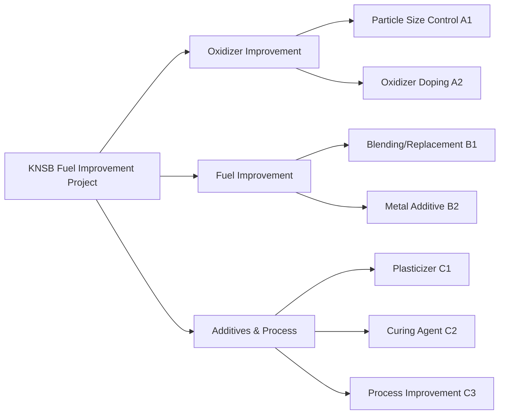
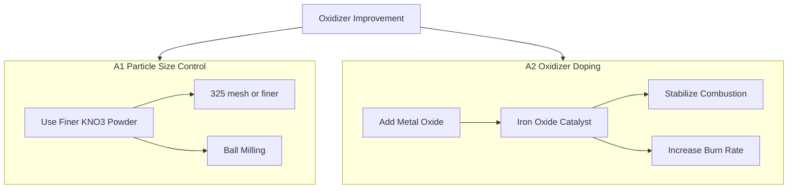
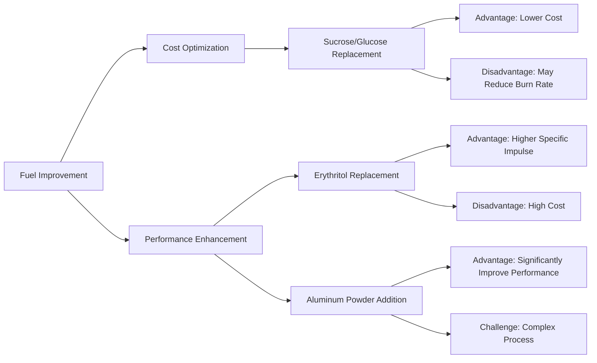
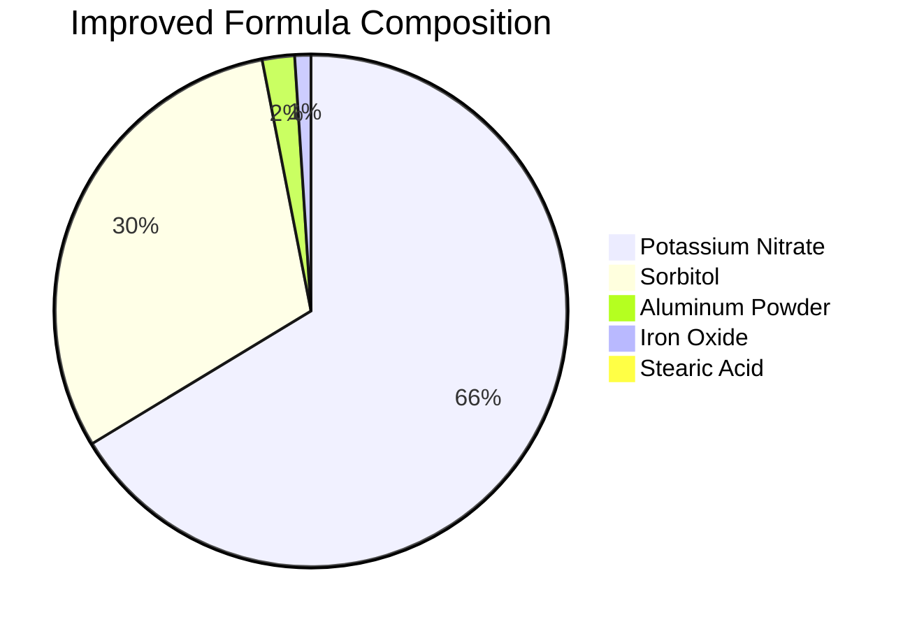
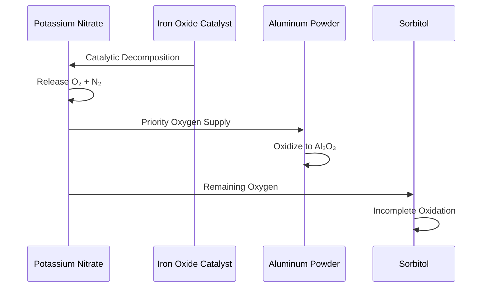
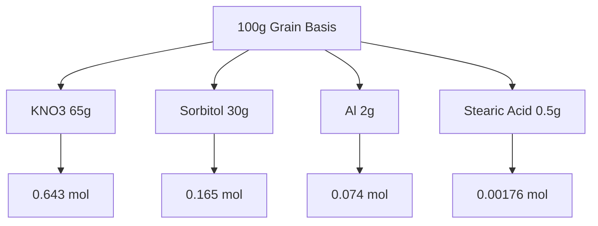
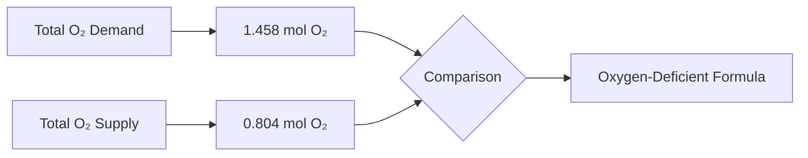
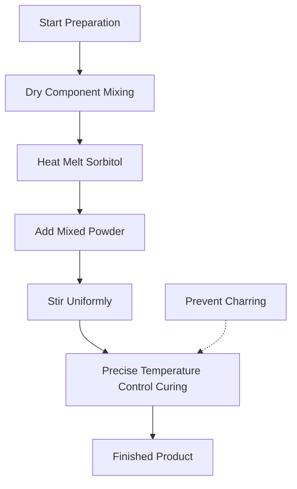
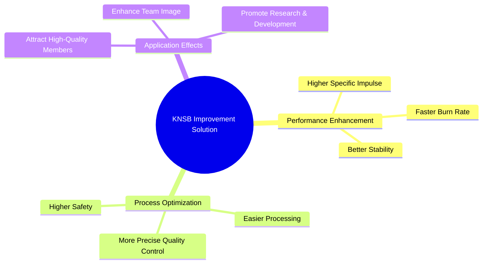

# KS IA - Weike Rocket Model Project Fuel Improvement Solution

## Project Overview

## Component Definitions

| Symbol | Component | Description |
|--------|-----------|-------------|
| K | Potassium Nitrate | Primary Oxidizer |
| N/S/B | Sorbitol | Primary Fuel and Binder |

!!! note "Formula Note"
    The classic KNSB formula is 65% Potassium Nitrate + 35% Sorbitol, a safe and stable sugar-based propellant.

## Detailed Improvement Solutions

### Oxidizer Improvement Path

### Fuel Improvement Comparison

## Solution A Specific Formula

### Component Ratio

### Reaction Process Analysis

## Chemical Reaction Calculations

### Molar Analysis

### Oxygen Balance Analysis

!!! warning "Important Note"
    This is an oxygen-deficient formula that relies on incomplete combustion products for higher specific impulse, but requires precise control of process conditions.

## Process Flow Chart

## Summary

!!! success "Project Achievement"
    This improvement solution effectively enhances propellant performance and provides strong technical support for the research team's external promotion and talent acquisition.