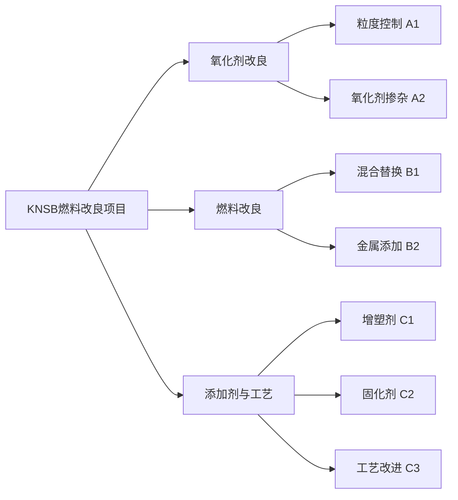
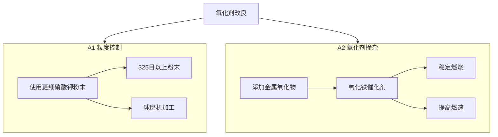
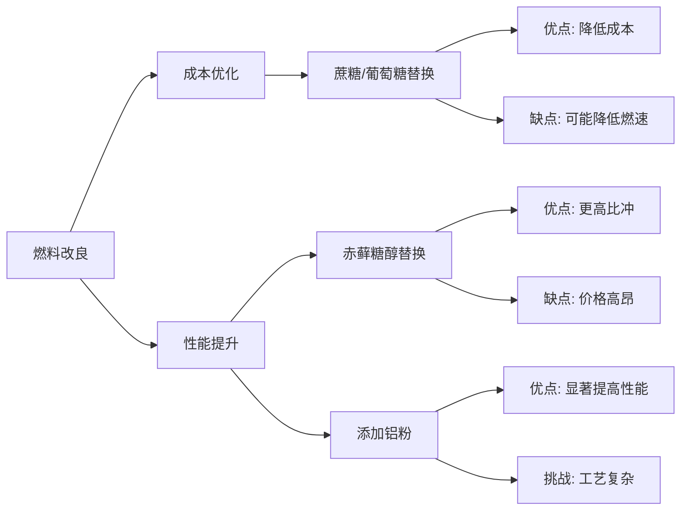
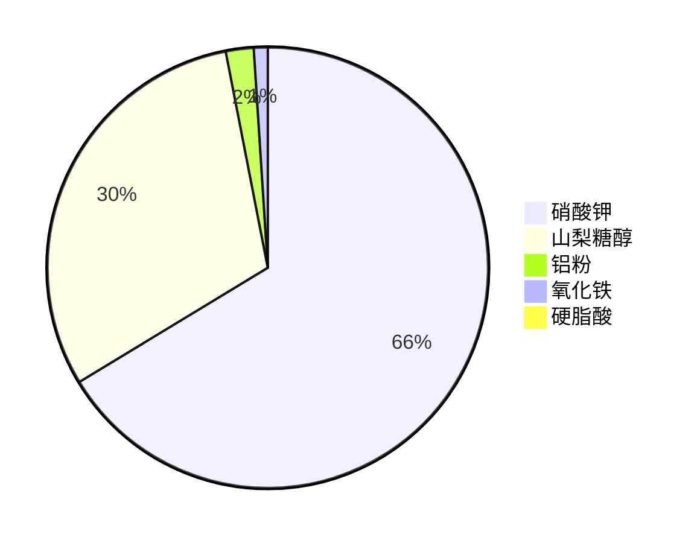
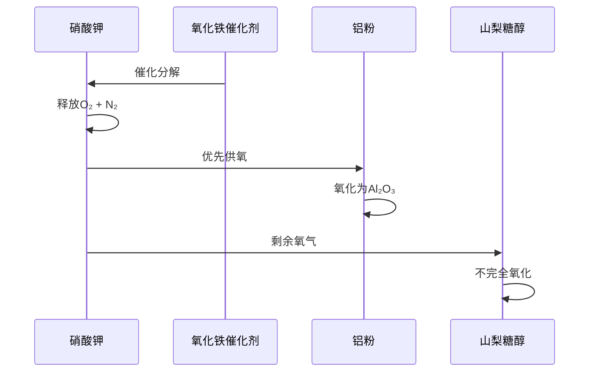
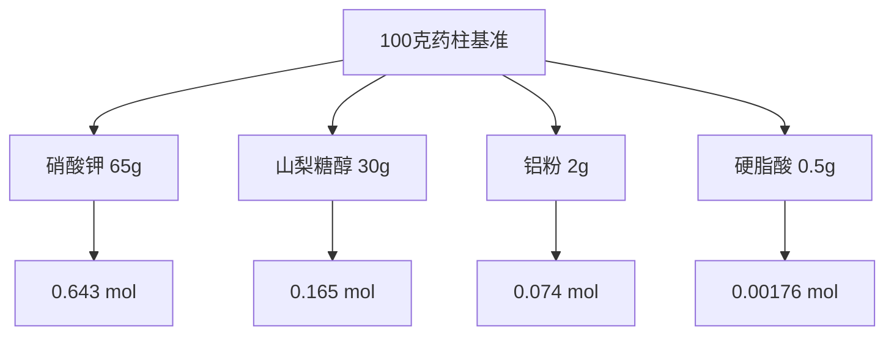
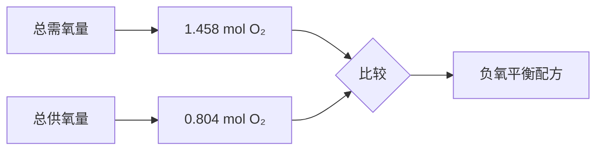
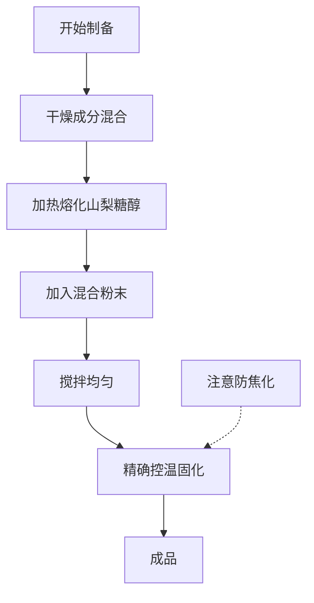
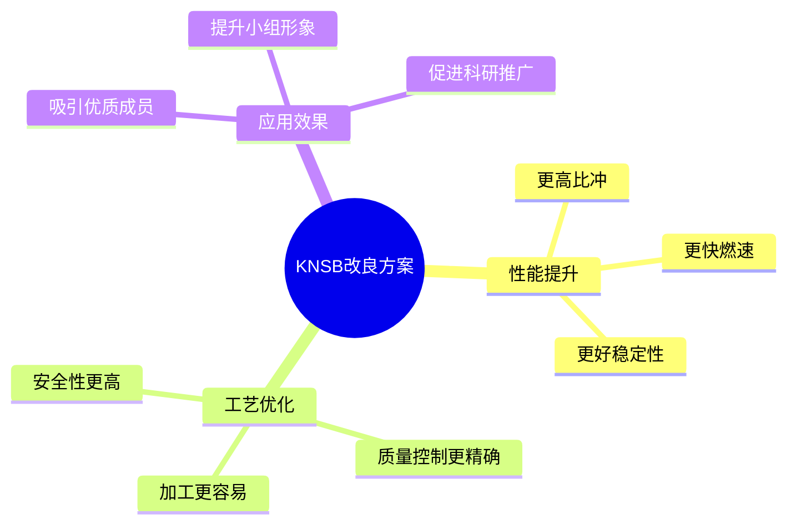

# KS IA - 维科火箭模型项目燃料改良方案

## 项目概述

## 成分定义

| 符号  | 成分     | 说明             |
| ----- | -------- | ---------------- |
| K     | 硝酸钾   | 主要氧化剂       |
| N/S/B | 山梨糖醇 | 主要燃料和粘结剂 |

!!! note "配方说明"
    经典 KNSB 配方为 65%硝酸钾 + 35%山梨糖醇，是一种安全稳定的糖基推进剂。

## 改良方案详解

### 氧化剂改良路径

### 燃料改良方案比较

## 方案 A 具体配方

### 成分配比

### 反应过程分析

## 化学反应计算

### 摩尔数分析

### 氧平衡分析

!!! warning "重要提示"
    这是一个负氧平衡配方，依赖不完全燃烧产物获得更高比冲，但需要精确控制工艺条件。

## 工艺流程图

## 总结

!!! success "项目成果"
    该改良方案有效提升了推进剂性能，为科研小组的对外推广和人才吸纳提供了有力技术支持。
