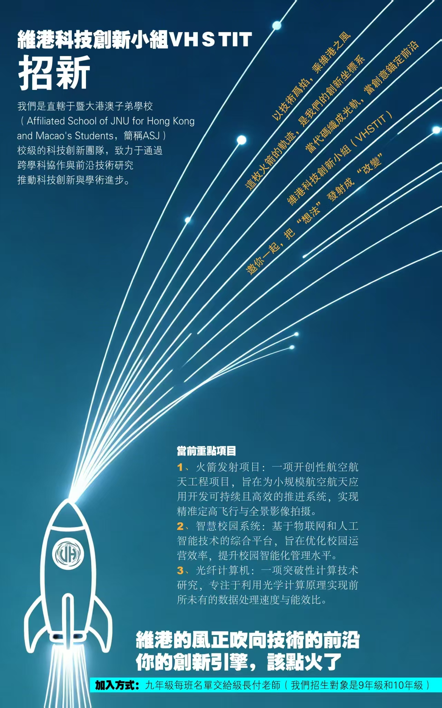

---
tags:
  - Participant
hide:
  - toc
---

# Xu Ziqi

As the publicity lead of the research team, Xu Ziqi leveraged excellent aesthetic design skills and a precise understanding of the team's positioning to independently complete the entire design process for the team's image promotion poster and the annual recruitment exclusive poster. Both posters feature distinctive styles and clear information, effectively showcasing the professional characteristics and team spirit of the research group. They also attracted a large number of high-potential candidates during the recruitment period, providing strong support for the team's external promotion and talent acquisition.

<figure markdown="span" style="max-width: 300px;">
  { loading=lazy }
  <figcaption>Poster</figcaption>
</figure>